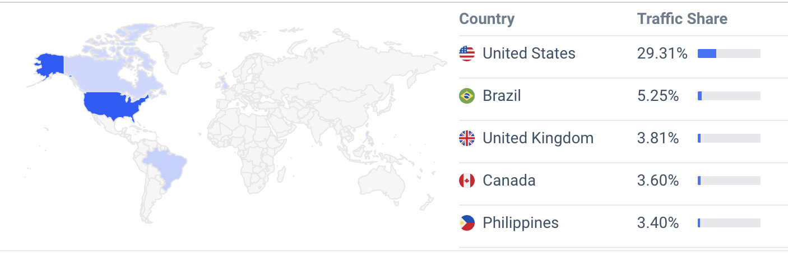

# Highload Discord
## 1. Тема и целевая аудитория

Discord — это платформа для общения, предназначенная для создания сообществ, обмена голосовыми, видео, а также текстовыми сообщениями.

### Ключевые функции
- Видеозвонки
- Текстовый чат
- Трансляция экрана
- Сервера (далее - сообщества)
- Возможность создавать множество голосовых комнат для одного сообщества
- Постоянные голосовые комнаты (можно выходить и заходить в любой момент, а не пересоздавать звонок)

### Аналоги
- Zoom
- TeamSpeak
- Microsoft Teams
- VK Звонки

### Пользователи
- Более 600 миллионов зарегистрированных пользователей [[1]](https://helplama.com/discord-statistics/)
- Более 150 млн уникальных пользователей в месяц (MAU) [[1]](https://helplama.com/discord-statistics/)
- Более 29 млн уникальных пользователей в день (DAU) [[1]](https://helplama.com/discord-statistics/)
- Более 850 миллионов сообщений в день, 25 миллионов из них сделаны с мобильного приложения [[3]](https://venturebeat.com/business/discord-crosses-250-million-users-as-it-hits-4-year-anniversary/)
- Рекордное кол-во одновременных пользователей - 8.2 млн человек[[4]](https://www.cloudwards.net/discord-statistics/)
- 4 млрд минут голосовых разговоров в день [[5]](https://findweb3.com/posts/discord-stats)
- Более 28,000 сообществ
- 90% сообществ имеет менее 15 участников [[4]](https://www.cloudwards.net/discord-statistics/)
- Самое большое сообщество - 571,000 участников [[6]](https://www.businessofapps.com/data/discord-statistics/)
- 590 млн посещений в месяц [[2]](https://pro.similarweb.com/#/digitalsuite/websiteanalysis/overview/website-performance/*/999/1m?webSource=Total&key=discord.com)

#### Целевая аудитория
- Геймеры
- Студенты
- Профессиональные сообщества
- Фандомы
и т.д.

#### Местоположение аудитории [[2]](https://pro.similarweb.com/#/digitalsuite/websiteanalysis/overview/website-performance/*/999/1m?webSource=Total&key=discord.com)

## 2. Тема и целевая аудитория
### Месячная аудитория 
- MAU = 150,000,000
### Дневная аудитория
- DAU = 29,000,000
### Средний размер хранилища
#### 
В среднем пользователь отправляет **29,3 сообщения в день**  
// *Всего сообщений в день / DAU = 850,000,000 / 29,000,000 = 29.3 сообщения в день*

На основе проанализированных данных (1291 сообщение):
- Среднее число символов в сообщении составило - 30.75 символов / сообщение
- 4.57% сообщений имели вложенную картинку
- 0.08% сообщений имели вложенный файл
 

 
Также на основе проанализированных данных:  

- В среднем аккаунту в дискорд ~ 4 года

### Хранилище

Максимальный размер аватарки - 10 Мбайт     
Максимальный размер вложенного файла - 10 Мбайт  
Максимальный размер вложенной картинки - 10 Мбайт, в среднем 2 Мбайт  
Допустим в среднем размер символа равен 2 байта (UTF-8).  

#### Средний пользователь:
- Сообщения: 29.3 * 30.75 * 2(байт) = 1,802 байт  
- Картинки: 29.3 * 4.57% * 2(Мбайт) = 2,808,108 байт  
- Файлы: 29.3 * 0.08% * 10(Мбайт) = 245,787 байт

Итого: 2.915 Мбайт / день = 1.04 Гбайт / год

Память на сообщения в день для всех пользователей:
- 850,000,000 * (30.75 * 2 + 4.57% * 2(Мбайт) + 0.08% * 10(Мбайт)) = 80.6 Тбайт / день = 28.73 Пбайт / год

#### Авторизационные данные:
- Аватарка: 2,000,000 байт
- Email: 30 * 1 байт = 30 байт (254 - макс. размер)
- Пароль: 16 * 1 байт = 16 байт
- id: 20 * 1 байт = 20 байт
- Никнейм: 15 * 1 байт = 15 байт

Итого: 2081 байт на пользователя

На всех пользователей: 
    600,000,000 * 2081 = 1,1356 Тбайт

#### **Итого необходимое хранилище:**
- Хранилище на 1 пользователя = 1.04(Гбайт/год) * 4(года) + 2081(байт) = **4.16 Гбайт**
- Общее хранилище = 28.73(Пб/год) * 4(года) + 1,1356(Тбайт) = **114.33 Пбайт**
  
<!-- |  | Объем хранилища|
|-------------|-------------:|
|Один пользователь|  4.16 Гбайт|
|Общее| 114.33 Пбайт | -->

### Сетевой трафик

#### Среднее количество запросов в день:
| Запрос | Пользователь (раз) | Общее количество (раз) |
|-------------|-------------:|-------------:|
| Отправить сообщение    | 29.3    | 850,000,000    |
<!-- | Отправить картинку    | 1.4    | 38,845,000    |
| Отправить файл| 0.02 | 680,000| -->
|Чтение сообщения||
|Чтение картинки||
|Чтение файла||

## Список источников
1. https://helplama.com/discord-statistics/
2. https://pro.similarweb.com/#/digitalsuite/websiteanalysis/overview/website-performance/*/999/1m?webSource=Total&key=discord.com
3. https://venturebeat.com/business/discord-crosses-250-million-users-as-it-hits-4-year-anniversary/
4. https://www.cloudwards.net/discord-statistics/
5. https://findweb3.com/posts/discord-stats
6. https://www.businessofapps.com/data/discord-statistics/
