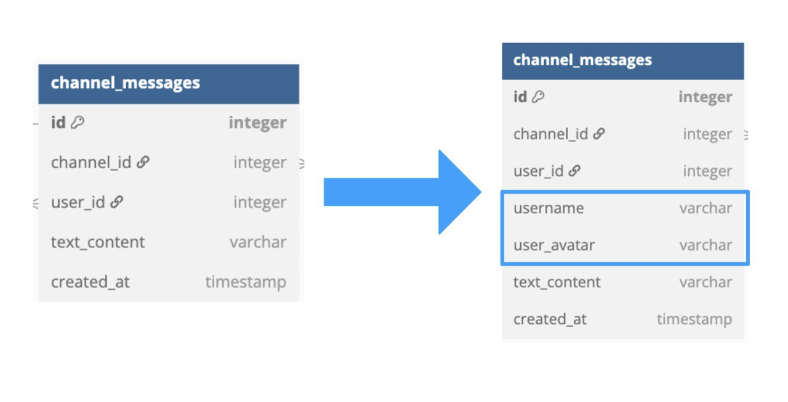
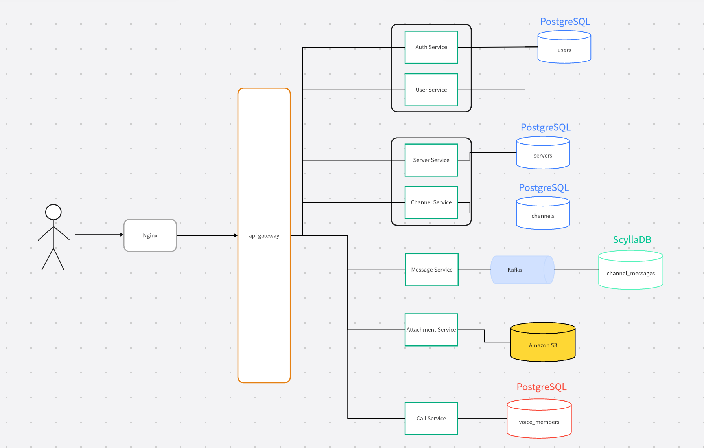

# Highload Discord

## Оглавление  
- [1. Тема и целевая аудитория](#1-тема-и-целевая-аудитория)  
- [2. Расчет нагрузки](#2-расчет-нагрузки)  
- [3. Глобальная балансировка нагрузки](#3-глобальная-балансировка-нагрузки)  
- [4. Локальная балансировка нагрузки](#4-локальная-балансировка-нагрузки)  
- [5. Логическая схема БД](#5-логическая-схема-бд)  
- [6. Физическая схема БД](#6-физическая-схема-бд)
- [8. Технологии](#8-технологии)
- [9. Обеспечение надежности](#9-обеспечение-надежности)
- [10. Схема проекта](#10-схема-проекта)
- [Список источников](#список-источников)  

## 1. Тема и целевая аудитория

Discord — это платформа для общения, предназначенная для создания сообществ, обмена голосовыми, видео, а также текстовыми сообщениями.

### Ключевые функции

- Видеозвонки
- Текстовый чат
- Трансляция экрана
- Сервера (далее - сообщества)
- Возможность создавать множество голосовых комнат для одного сообщества
- Постоянные голосовые комнаты (можно выходить и заходить в любой момент, а не пересоздавать звонок)

### Аналоги

- Zoom
- TeamSpeak
- Microsoft Teams
- VK Звонки

### Пользователи

-  600 миллионов зарегистрированных пользователей [[10]](https://www.demandsage.com/discord-statistics/)
- Более 150 млн уникальных пользователей в месяц (MAU) [[1]](https://helplama.com/discord-statistics/)
- Более 29 млн уникальных пользователей в день (DAU) [[1]](https://helplama.com/discord-statistics/)
- Более 850 миллионов сообщений в день, 25 миллионов из них сделаны с мобильного приложения [[3]](https://venturebeat.com/business/discord-crosses-250-million-users-as-it-hits-4-year-anniversary/)
- Рекордное кол-во одновременных пользователей - 8.2 млн человек[[4]](https://www.cloudwards.net/discord-statistics/)
- 4 млрд минут голосовых разговоров в день [[5]](https://findweb3.com/posts/discord-stats)
- 90% сообществ имеет менее 15 участников [[4]](https://www.cloudwards.net/discord-statistics/)
- Самое большое сообщество - 571,000 участников [[6]](https://www.businessofapps.com/data/discord-statistics/)
- более 19 миллионов сообществ [[8]](https://thesmallbusinessblog.com/how-many-discord-servers-are-there/)
- 590 млн посещений в месяц [[2]](https://pro.similarweb.com/#/digitalsuite/websiteanalysis/overview/website-performance/*/999/1m?webSource=Total&key=discord.com)

#### Целевая аудитория

- Геймеры
- Студенты
- Профессиональные сообщества
- Фандомы
  и т.д.

#### Местоположение аудитории

| Страна                     | Процент от общего трафика |
| -------------------------- | ----------------------: |
| США        |                    24.27% | 
| Бразилия          |                     5.84% |
| Индия |                       5.18% |
| Канада     |                         3.22%|
| Филиппины                      |                         3.06% |

Страны, в которых Discord заблокирован:  
Китай, ОАЭ, Оман, Иран, Северная Корея, Египет и Россия

## 2. Расчет нагрузки

### Месячная аудитория

- MAU = 150,000,000

### Дневная аудитория

- DAU = 29,000,000

####

В среднем пользователь отправляет **29,3 сообщения в день**  
// *Всего сообщений в день / DAU = 850,000,000 / 29,000,000 = 29.3 сообщения в день*

На основе проанализированных данных (1291 сообщение):

- Среднее число символов в сообщении составило - 30.75 символов / сообщение
- 4.57% сообщений имели вложенную картинку
- 0.08% сообщений имели вложенный файл

Также на основе проанализированных данных:  
*Рассчитывалось по [таблице](https://www.bankmycell.com/blog/number-of-discord-users/#section-1) с количеством зарегистрированных аккаунтов за каждый год*

- В среднем аккаунту в дискорд ~ 4 года

### Хранилище

Максимальный размер аватарки - 10 Мбайт  
Максимальный размер вложенного файла - 10 Мбайт  
Максимальный размер вложенной картинки - 10 Мбайт, в среднем 2 Мбайт  
Допустим в среднем размер символа равен 2 байта (UTF-8).

#### Средний пользователь отправляет в день:

- Сообщения: 29.3 * 30.75 * 2(байт) = 1,802 байт
- Картинки: 29.3 * 4.57% * 2(Мбайт) = 2,808,108 байт
- Файлы: 29.3 * 0.08% * 10(Мбайт) = 245,787 байт

Итого: 2.915 Мбайт / день = 1.04 Гбайт / год

Память на сообщения для всех пользователей:

- 850,000,000 * (30.75 * 2 + 4.57% * 2(Мбайт) + 0.08% * 10(Мбайт)) = 80.6 Тбайт / день = **28.73 Пбайт / год**

#### Авторизационные данные:

- Аватарка: 2,000,000 байт
- Email: 30 \* 1 байт = 30 байт (254 - макс. размер)
- Пароль: 16 \* 1 байт = 16 байт
- id: 20 \* 1 байт = 20 байт
- Никнейм: 15 \* 1 байт = 15 байт

Итого: 2081 байт на пользователя

На всех пользователей:
600,000,000 \* 2081 = 1,1356 Тбайт

#### **Итого необходимое хранилище:**

- Хранилище на 1 пользователя = 1.04(Гбайт/год) \* 4(года) + 2081(байт) = **4.16 Гбайт**
- Общее хранилище = 28.73(Пб/год) \* 4(года) + 1,1356(Тбайт) = **114.33 Пбайт**

| Параметр               | Хранилище (1 пользователь) |         Общее |
| ---------------------- | -------------------------: | ------------: |
| Текстовые сообщения    |                  7208 байт |   0.004 Пбайт |
| Картинки               |            11,232,432 байт |  105.63 Пбайт |
| Файлы                  |               983,148 байт |    9.24 Пбайт |
| Авторизационные данные |                  2081 байт |   0.001 Пбайт |
| Общее                  |                 4.16 Гбайт | 114.875 Пбайт |

### Сетевой трафик

&nbsp;&nbsp;&nbsp;&nbsp;Пиковая нагрузка дискорд в 2018 году составила одновременно более 2.6 миллиона пользователей голосового чата с исходящим с трафиком более 220 Гбит/с и 120 млн пакетов/с [[7]](https://habr.com/ru/articles/423171/)
 
 
&nbsp;&nbsp;&nbsp;&nbsp;В 2018 году DAU составлял 8.9 миллионов пользователей, с учетом текущего DAU рассчитаем примерную пиковую нагрузку на данный момент:

- 2.6 миллиона \* 29,000,000 / 8,900,000 = **8.47 миллиона пользователей голосового чата**
- 220 Гбит/с \* 29,000,000 / 8,900,000 = **717 Гбит/с**
- 120 млн пакетов/с \* 29,000,000 / 8,900,000 = **391 млн пакетов/с**

=> В среднем на одного пользователя видео-чата трафик = 88 Кбит/с

#### Средний трафик в секунду для видео звонков

- Каждый день в среднем в дискорде происходит 4 млрд минут голосовых разговоров в день
- Средний трафик звоноков в день: 4 (млрд мин) * 60 * 88 Кбит/с = 20,141,602 Гбит/день
- Средний трафик в секунду: 20,141,602 Гбит / (24 * 60 * 60) = 233.2 Гбит/с

#### Средний трафик отправки сообщений в секунду

- Общий трафик отправки сообщений в день = 80.6 Тбайт/день = 82,534.4 Гбит/день (из предыдущих вычислений)
- Общий трафик отправки сообщений в секнуду: 80.6 Тбайт/день / (24 * 60 * 60) = 7.64 Гбит/с

#### Общий (средний) трафик

- 233.2 Гбит/с + 7.64 Гбит/с = **240.84 Гбит/с**

### Итого трафик:

Коэффициент запаса на пиковое потребление относительно среднего для видеочата = 717 Гбит/с / 233.2 Гбит/с = 3.08 Гбит/с  
Пиковый трафик для сообщений = средний трафик для сообщений * коэффициент запаса = 7.64 Гбит/с * 3.08 Гбит/с = 23.53 Гбит/с

| Тип трафика |    Общий суточный |       Средний |       Пиковый |
| ----------- | ----------------: | ------------: | ------------: |
| Видеочат    |   20,141,602 Гбит |  233.2 Гбит/с |    717 Гбит/с |
| Сообщения   |     82,534.4 Гбит |   7.64 Гбит/с |  23.53 Гбит/с |
| Всего       | 20,224,136.4 Гбит | 240.84 Гбит/с | 740.53 Гбит/с |

#### Метрики запросов:

Сообщества:  
&nbsp;&nbsp;&nbsp;&nbsp;Существует более 19 млн сообществ, 90% из которых имеют менее 15 подписчиков  
&nbsp;&nbsp;&nbsp;&nbsp;Предположим, что в среднем 90% сообществ имеют 7 подписчиков, а оставшиеся 10% - 100 подписчиков

- Всего подписчиков = 19 млн * 90% * 7 + 19 млн * 10% * 100 = 309,700,000 подписчиков
- Кол-во запросов на подписку в секунду = 309,700,000 / ( 9(лет) * 365 * 24 * 60 * 60) = 1.1 запрос/секунду

- Во время звонка по webRTC звук и видео делятся на пакеты по 20 мс и отправляются в виде UDP пакета с помощью протокола RTP(Real-time Transport protocol)  
  Кол-во пакетов/сек = 4 млрд мин * 60 / (0.02 * 24 * 60 * 60) = **139 млн пакетов/сек***
- Помимио этого существует протокол RTCP(Real-time Transport Control Protocol), c помощью которого отправляются RTCP-отчеты, Основной функцией которых является мониторинг качества обслуживания, предоставляемого протоколом RTP.
  RTCP отправляется каждые 5 секунд => 4 млрд мин / 5 сек = 48 млрд отправок в день = **555,555 отправок в секунду**

##### Рассчитаем RPS на чтение сообщений:
850,000,000 сообщений в день  
Среднее число подписчиков: 7 * 90% + 100 * 10% = 16.3 подписчика  
Допустим активная часть подписчиков равна 20% от числа подписчиков сообщества, тогда  
Среднее значение активных подписчиков = 16.3 * 20% = 3,26 подписчика => Потенциальное число просмотров для одного сообщения = 3,26  
Общее число чтений = 850,000,000 * 3,26 = 2,771,000,000  
Пользователь запрашивает сообщения батчами(10 сообщений), а если он уже находится в чате, то новые сообщения приходят через Long polling. Предположим, что пользователь в среднем отправляет 1 запрос на получение 15 сообщений  
Общее число запросов на чтение в день = 2,771,000,000 / 15 = 184,733,333 запросов/день
RPS на чтение сообщений = 184,733,333 / 86,400 = 2,138 запросов/секунду 

Предположим, что средний активный пользователь заходит в 3 голосовые комнаты в день  

##### Рассчитаем RPS на создание пользователей:  
По [таблице](https://www.bankmycell.com/blog/number-of-discord-users/#section-1) с совокупным количеством пользователей за каждый год видим, что за последний год прибавилось 50 млн. пользователей => 1.6 RPS  
##### Рассчитаем RPS на создание сообществ:  
По информации из [источника](https://www.clrn.org/how-many-discord-servers-are-there/) в день создается 300,000+ сообществ, что равносильно 3,5 запросов в секунду  

| Запрос                     | Пользователь (раз/день) | Общее количество (раз/день) |   Общее количество (раз/секунду) |
| -------------------------- | ----------------------: | --------------------------: | -----: |
| Отправить сообщение        |                    29.3 |                 850,000,000 |   9,838 |
| Чтение сообщения           |                     293 |                 184,733,333 |   2,138 |
| Вход/выход в голосовой чат |                       6 |                  90,000,000 |   1,041 | 
| Подписка на сообщество     |                         |                             |    1.1 |
| Создание пользователя     |                         |                             |    1.6 |
| Создание сообщества     |                         |                             |    3.5 |
| Всего RPS                  |                         |                             | 13,018 |
| RTCP                       |                         |              48,000,000,000 |    555,555 |
| RTP                       |                         |               |    139 млн пакетов/сек |

<!-- | Отправить картинку    | 1.4    | 38,845,000    |
| Отправить файл| 0.02 | 680,000| -->

## 3. Глобальная балансировка нагрузки

### Расположение ДЦ:

При размещении ЦОДов будем учитывать:  
- данные из пункта "1. Тема и целевая аудитория"
- географическое рапределение плотности населения
- карту ЦОДов мира. [[11]](https://map.datacente.rs/)

&nbsp;&nbsp;&nbsp;&nbsp;Почти 30% трафика от пользователей идет из Северной Америки, а оставшиеся 70% равномерно распределены между другими регионами.  

#### Разделим сервис на поддомены 
- chat.discord.com - для текстового чата
- call.discord.com - для видеочата

#### Трафик для текстового чата

Для трафика chat.discord.com расположим единый ДЦ в Чикаго, так как почти 30% трафика от пользователей идет из Северной Америки. Все операции с БД будут идти на этот ДЦ.

#### Трафик для видео чата  
Трафик, необходимый для видеочата распределим по миру. ДЦ будет выбираться с использованием Latency-based DNS, чтобы выдавать адрес ближайшего к создателю видео-чата ДЦ с минимальным RTT, так как для звонков необходимо наименьшее latency, а  трафик от остальных участников чата будет направляться на этот же ДЦ, независимо от их месторасположения.

&nbsp;&nbsp;&nbsp;&nbsp;4 ЦОД в Северной Америке(~7.5% трафика) и 10 ЦОД на весь оставшийся мир (~7% трафика)

Всего 14 ЦОД:
- 4 ЦОД в Северной Америке(Чикаго, Ванкувер, Лос-Анджелес, Нью-Йорк) будут обрабатывать по:
  -  139 млн пакетов/сек * 7,5% = 10.5 млн UDP пакетов/сек
  -  555,555 * 7,5% = 41,667 отправок RTCP отчетов / сек
- Остальные 10 ЦОД:
  -  139 млн пакетов/сек * 7% = 9.7 млн UDP пакетов/сек
  -  555,555 * 7% = 38,888 отправок RTCP отчетов / сек

## 4. Локальная балансировка нагрузки

#### Локальная балансировка видеочата  
&nbsp;&nbsp;&nbsp;&nbsp;Для локальной балансировки трафика видеочата будем использовать **L4 балансировку**, так как WebRTC работает поверх UDP и требует минимальной задержки. В то время как L7 балансировка анализирует содержимое пакетов, что может вызвать дополнительные задержки.

&nbsp;&nbsp;&nbsp;&nbsp;Будем использовать **Google Maglev**, внутри него используется VIP(virtual IP), поэтому при падении одного сервера, трафик перенаправится на другой сервер с тем же VIP, и звонок продолжится.

#### Локальная балансировка текстового чата

&nbsp;&nbsp;&nbsp;&nbsp; Для локальной балансировки будем использовать Nginx в  качестве reverse-proxy, который  будет принимать запросы пользователей и направлять их на нужные сервисы в кластере Kubernetes, а также кешировать статику и сжимать данные с помощью gzip

&nbsp;&nbsp;&nbsp;&nbsp; Сервисы Kubernetes будут масштабироваться автоматически в зависимости от нагрузки, обеспечивая обработку большого числа пользователей.

&nbsp;&nbsp;&nbsp;&nbsp; Будет выполняться SSL termination, чтобы https расшифровывался и передавался внутри ДЦ по http, что позволит снизить задержку

## 5. Логическая схема БД

Описание таблиц
| Таблица               | Описание | Размер сущности  | Количество  | Размер|
| ---------------------- | -------------------------: | -------------------------: | -------------------------: | -------------------------: |
| servers |                  Хранит информацию о сообществах | id = 4 байт   title = 100 байт   avatar = 255 байт   description = 500 байт     **Итого: 859 байт**  | 19 миллионов | 15 Гб
| server_users             | Связывает пользователей с сообществом        | id = 4 байт   user_id = 4 байт   server_id = 4 байт   is_owner = 1 байт     **Итого: 13 байт** | 19 млн * 90% * 15 + 19 млн * 10% * 100 = = 446,5 млн | 5,4 Гб
| channels                  |               Хранит информацию о каналах внутри сообществ | id = 4 байт   title = 100 байт   type = 10 байт   server_id = 4 байт     **Итого: 118 байт**| (допустим в каждом сообществе в среднем 3 канала)  19 миллионов * 3 =   = 57 млн | 6,26 Гб
| users |                 Хранит информацию о пользователях | id = 4 байт   username = 15 байт    login = 50 байт   password = 16 байт   email = 30 байт   avatar = 255 байт     **Итого: 370 байт**| 600 миллионов | 206 Гб
| channel_messages                  |   Хранит сообщения в каналах | id = 4 байт   channel_id = 4 байт   user_id = 4 байт   text_content = 1,802 байт   created_at = 8 байт     **Итого: 1,822 байт**| 1,55 * 10^6 млн | 521 Тб
| attachments                  |   Хранит вложения (файлы), прикрепленные к сообщениям | id = 4 байт   message_id = 4 байт   message_type = 20 байт   file_path = 255 байт   file_name = 255 байт     **Итого: 538 байт**| 7,2 * 10^4 млн | 35,2 Тб
| voice_members                  |   Связывает пользователя с голосовым каналом | id = 4 байт   user_id = 4 байт   channel_id = 4 байт     **Итого: 12 байт**| 7,25 млн | 0.081 Гб

| Таблица               | RPS |
| ---------------------- | -------------------------: |
| servers | 3.5 |
| server_users | 1.1 |
| channels | 10.5 |
| users | 1.6 |
| channel_messages | 11,976 |
| attachments | 556.8 |
| voice_members | 1 |

#### Рассчитаем общее кол-во сообщений:
  850 млн сообщений отправляется в день. 
  - Допустим каждый год стреднее кол-во сообщений в сервисе увеличивалось равномерно => среднее количество сообщений в день за всё время = (0 + 850) / 2 = 425 млн сообщений / день 
  - Тогда общее количество сообщений = 425 * 365 * 10лет = 1,55 * 10^12 сообщений  

#### Рассчитаем общее количество вложений:  
  По ранее вычесленным данным:
  - 4.57% сообщений имели вложенную картинку
  - 0.08% сообщений имели вложенный файл

  Тогда общеее число сообщений с вложениями = 4,65% * 1,55 * 10^12 = 7,2 * 10^10 

#### Рассчитаем общее количество участников голосового канала:
  Ранее мы допускали, что активный пользователь в среднем заходит в 3 голосовые комнаты в день (DAU = 29 млн), тогда за день будет 29 * 3 = 87 млн записей в БД  
  Пусть пользователь в среднем проводит в голосовой комнате 30 минут => тогда единовременно в голосовых комнатах находятся = 87 млн * 0,5 часа / 24 часа = 7,25 млн пользователей

## 6. Физическая схема БД

### Выбор СУБД:
| Таблица               | СУБД | Индексы  |
| ---------------------- | -------------------------: | -------------------------: |
| servers |                  PostgreSQL | title|
| server_users             | PostgreSQL        | server_id   user_id|
| channels                  |               PostgreSQL | server_id |
| users |                 PostgreSQL |  username |
| channel_messages                  |   ScyllaDB | {Partition Key = channel_id, Clustering Key = created_at}    |
| attachments                  | S3 | Организация объектов по директориям |
| voice_members                  |   Redis | channel_id:{users_id} (ключ - channel_id, значение - сет user_id)   users_id:channel_id (ключ - user_id, значение - channel_id) |

- PostgreSQL - реляционная БД для структурированных данных, в которой важны связи, целостность и сложные запросы
- ScyllaDB - NoSQL БД для хранения данных с частыми операциями записи и чтения, быстрее, чем Cassandra
- Redis - in-memory хранилище для быстрого создания и удаления данных, такие как - участие в звонке.

### Денормализация
&nbsp;&nbsp;&nbsp;&nbsp;Чтобы операции чтения и записи сообщений происходили с меньшим числом задержек - денормализуем таблицу **channel_messages**, избавляя её от необходимости использовать JOIN. Добавим поля **username** и **user_avatar** в таблицу
  

Дополнительная память, занимаемая денормализацией
Количество сообщений в день * Вес денормализованных полей * 365 =  
850,000,000 * (15 + 4) * 365 = 5.361 Тб/год

### Партиционирование:
&nbsp;&nbsp;&nbsp;&nbsp;Данных в таблице **channel_messages** очень много, поэтому сделаем партиционирование.  
&nbsp;&nbsp;&nbsp;&nbsp;Делать партиционирование по ключу **channel_id** не эффективно, так как нагрузка на один узел может быть слишком велика, так как есть каналы, где активность очень высокая.  
&nbsp;&nbsp;&nbsp;&nbsp;Партиционировать сделаем по **channel_id** и **bucket** - окно времени, в нашем случае 1 минута, чтобы в партиции не было слишком много данных  
&nbsp;&nbsp;&nbsp;&nbsp;*Так как RPS на запись 9838 => в минуту 590,280 записей в БД => 590,280 размер бакета*

### Шардирование и резервирование СУБД:

| Таблица               | СУБД | Шардинг  | Резервирование|  
| ---------------------- | -------------------------: | -------------------------: | -------------------------: |
| servers |                  PostgreSQL | - | master-slave |
| server_users             | PostgreSQL        | - | master-slave |
| channels                  |               PostgreSQL | - | master-slave |
| users |                 PostgreSQL |  - | master-slave |
| channel_messages                  |   ScyllaDB | автоматически  | автоматически |
| attachments                  |   S3 | автоматически | Amazon S3 Replication |
| voice_members                  |   Redis | Redis Cluster | Redis Cluster|

## 8. Технологии
| Технология               | область примерения | Описание  |
| ---------------------- | :------------------------- | :------------------------- |
| Rust | Низкоуровневое взаимодействие  | Для обработки звука и видео будем использовать Rust, так как это производительный низкоуровневый язык программирования, без сборщика мусора, который будет эффективен для работы в реальном времени с минимальными задержками. | 
| Golang | Api и бизнес-логика | Проще в разработке, удобен для высокоуровневых сервисов.   | 
| Nginx | reverse-proxy | Балансировка, роутинг, ssl терминация | 
| Kafka | Брокер сообщений | Доставка пользовательских сообщений(exactly once) в распределённой системе | 
| PostgreSQL | Почти все таблицы  |  Основная реляционная СУБД для хранения критически важных структурированных данных, требующих целостности, транзакционности и сложных запросов |
| ScyllaDB | Запись сообщений | Поддержка  высокой частоты записи в конец таблицы, а также автоматическое шардирование и реплицирование данных. Более эффективный, чем Cassandra, так как написан на C++ | 
| Redis | Таблица участников голового чата | Высокая производительность, поддерживает pub/sub для реального обновления | 
| Amazon S3 | Хранение вложений | Наиболее популярное, надежное решение | 
| React + TS | Фронтенд | Строгая типизация и высокая производительность за счёт виртуального DOM | 
| Tauri (Rust) | Десктоп | Удобнее QT, Поддерживает React/Vue/Svelte без переписывания кода, совместим с бэкендом, кооторый тоже частично на Rust  | 
| Flutter | Мобильное приложение | Кроссплатформенный ЯП | 
| k8S | Оркестрация | Автоматическое развертывание, масштабирование и обновление контейнеров | 
  
## 9. Обеспечение надежности
| Компонент               | способ резервирования |
| ---------------------- | :------------------------- |
| Redis |  При падении master Sentinel автоматически выбирает новую master из replica и перенаправляет клиентов. (Автоматический failover.);   Redis Cluster (шардирование + репликация) |
| ScyllaDB | Регулярные бэкапы   Replication Factor (RF=3) – данные реплицируются на 3+ узла, чтобы пережить отказ одного или даже двух |
| Nginx | Распределение трафика с health-check. |
| Circuit Breaker | Защита от каскадных сбоев. |
| Prometheus + Grafana | Метрики в реальном времени. |
| PostgreSQL | Репликация (master-slave) |

## 10. Схема проекта
  
- Auth Service - Аутентификация пользователей
- User Service - Управление профилями пользователей и пользовательскими настройками.(CRUD-профиля (никнейм, аватар, статус))
- Server Service - Управление логикой сообществ
- Channel Service - Управление каналами внутри серверов
- Message Service - Приём и отправка сообщений через WebSocket или HTTPS
- Call Service - Организация голосовых и видео-чатов, WebRTC-сигналинг, пересылка RTP-пакетов.

## 11. Список серверов

## Список источников

1. https://helplama.com/discord-statistics/
2. https://pro.similarweb.com/#/digitalsuite/websiteanalysis/overview/website-performance/*/999/1m?webSource=Total&key=discord.com
3. https://venturebeat.com/business/discord-crosses-250-million-users-as-it-hits-4-year-anniversary/
4. https://www.cloudwards.net/discord-statistics/
5. https://findweb3.com/posts/discord-stats
6. https://www.businessofapps.com/data/discord-statistics/
7. https://habr.com/ru/articles/423171/
8. https://thesmallbusinessblog.com/how-many-discord-servers-are-there/
9. https://www.bankmycell.com/blog/number-of-discord-users/#section-1
10. https://www.demandsage.com/discord-statistics/
11. https://map.datacente.rs/
